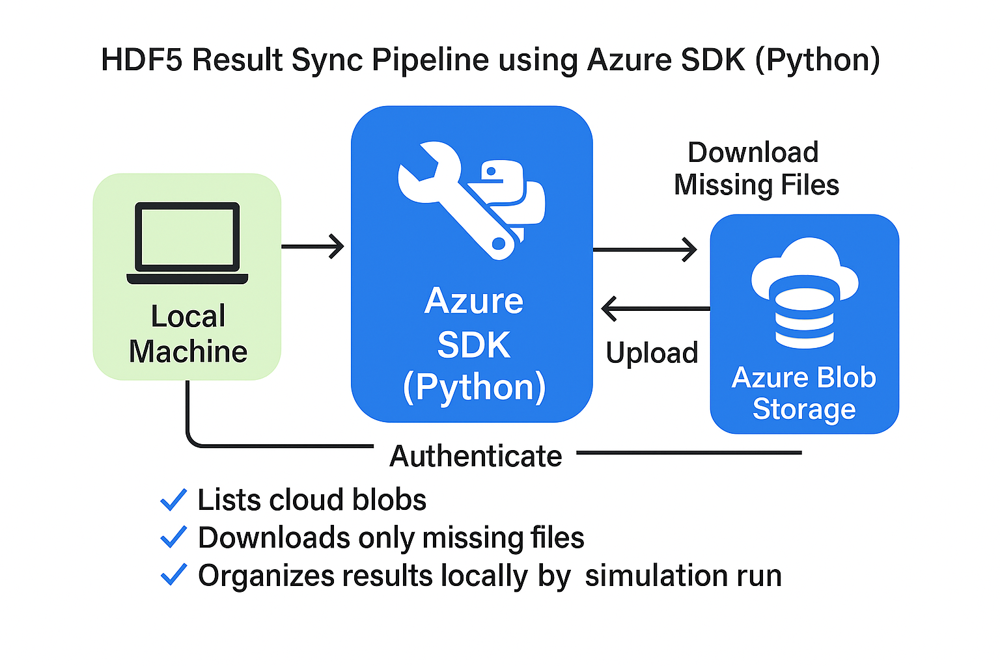

# HDF5 Simulation Result Sync Pipeline using Azure Blob Storage

## Overview
This project implements a lightweight pipeline for managing geophysical simulation results. Using the Azure SDK for Python, it allows local systems to retrieve simulation output files stored in Azure Blob Storage, download only missing files, and organize them by simulation run for further inspection or analysis.

## Architecture Diagram



## Key Features
- Downloads only missing HDF5 files from Azure Blob Storage.
- Organizes files locally by simulation run (e.g., `run_01`, `run_02`).
- Uses Azure SDK for secure and efficient blob interaction.
- Portable, easy-to-use Python script with `.env` support.

---

## 🔧 Setup Instructions

### 1. Create an Azure Storage Account
1. Go to [https://portal.azure.com](https://portal.azure.com)
2. Search for “Storage accounts” and click “Create”.
3. Select a subscription and resource group.
4. Provide a unique storage account name.
5. Choose a region and select `Standard` performance.
6. Review and create.

### 2. Create a Blob Container
1. Inside the storage account, go to **Containers**.
2. Click “+ Container”, name it (e.g., `simulation-data`), and set access level to **Private**.

### 3. Get the Connection String
1. In the Storage Account, go to **Access Keys**.
2. Copy the **connection string** under key1.

### 4. Create `.env` File in Project Root
```
AZURE_STORAGE_CONNECTION_STRING=your_connection_string_here
AZURE_STORAGE_CONTAINER_NAME=simulation-data
```

---

## 📁 Folder Structure Example
```
mock_hdf5_runs/
├── run_01/
│   ├── sample_01.h5
│   └── sample_02.h5
├── run_02/
│   ├── sample_01.h5
│   └── sample_02.h5

.env                 # Not committed to version control
logs/                # Contains upload.log and download.log
```

---

## How to Use

### 1. Install Dependencies
```bash
pip install -r requirements.txt
```

### 2. Generate Sample HDF5 Data (Optional)
```bash
python generate_hdfs.py
```

### 3. Upload Files to Azure
```bash
python upload_to_azure.py
```

### 4. Download and Organize Files
```bash
python download_from_azure.py
```

---

## 📄 Files Included

- `generate_hdfs.py`: Generates test `.h5` files (optional).
- `upload_to_azure.py`: Uploads local HDF5 files to Azure Blob.
- `download_from_azure.py`: Downloads only missing files and organizes them.
- `.env`: Holds credentials for secure access (ignored by Git).
- `requirements.txt`: List of required Python packages.
- `pipeline.png`: Architecture diagram.
- `logs/`: Optional logs directory.

---

## 👤 Author
**Suleiman Ojo**
